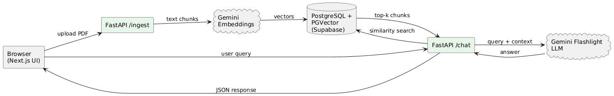

# 📄 Document AI Chat

Chat with any PDF as if it were a knowledgeable assistant.  
The project showcases a **Retrieval-Augmented Generation (RAG)** workflow built with FastAPI, PostgreSQL + pgvector, Google Gemini and a React / Next.js frontend.

<p align="center">
  
</p>

---

## ✨ Features
- **Document ingestion** – drag-and-drop a PDF; text is chunked and embedded with Gemini.
- **Vector search** – pgvector extension stores embeddings and performs similarity lookup.
- **RAG prompt construction** – top-k chunks are sent to Gemini Flashlight for an answer.
- **Light / Dark UI** – fully responsive, themeable interface built with Tailwind CSS.
- **Streaming-ready API** – FastAPI endpoints designed for real-time chat (currently returns a single JSON payload, trivial to extend).
- **Stateless frontend** – each document upload receives a short-lived `upload_id`; state persists in localStorage and expires after 7 days.
- **Containerised stack** – one-command bootstrap via Docker Compose.

---

## 🏗️ Tech Stack

| Layer       | Tech                                         | Role                                                                    |
|-------------|----------------------------------------------|-------------------------------------------------------------------------|
| Frontend    | Next.js 14, React 18, Tailwind CSS, Heroicons| File upload, chat UI, dark-mode, SSR/ISR ready                          |
| Backend     | FastAPI 0.111                                | `/ingest` (PDF → embeddings) & `/chat` (query → answer) endpoints       |
| Database    | PostgreSQL 15 + pgvector 0.6                 | Vector store (`embeddings` table + cosine search `ivfflat` index)       |
| Embeddings  | Google Gemini *text-embedding-004*           | 768-d float vector per text chunk                                       |
| LLM         | Google Gemini *Flashlight*                   | Generates final answer given query + retrieved context                  |
| Infrastructure | Docker, Docker Compose                    | Local orchestration; trivial to port to Render, Fly, GCP, etc.          |

---

## 🗂️ Repository Layout

* **backend/** 
  FastAPI app, Dockerfiles, SQL migrations & cron jobs
* **frontend/**
  Next.js UI, components, pages, Tailwind config
* **README.md** ↩︎ you are here


---

## 🚀 Quick Start

### 1. Clone & configure
```bash
git clone https://github.com/<your-org>/document-ai-chat.git
cp backend/.env.example backend/.env    # add DATABASE_URL & GEMINI_API_KEY
```

### 2. Run the full stack
```bash
# start Postgres, pgvector and FastAPI
cd backend
docker compose up --build               # http://localhost:8000

# new terminal: start Next.js dev server
cd ../frontend
npm ci                                   # installs exact lockfile versions
npm run dev                              # http://localhost:3000
```
The UI will hot-reload on file changes; backend will reload via `uvicorn --reload`.

---

## 🔧 Configuration

| Variable            | Location        | Description                                |
|---------------------|-----------------|--------------------------------------------|
| `DATABASE_URL`      | `backend/.env`  | Postgres connection string incl. `pgvector`|
| `GEMINI_API_KEY`    | `backend/.env`  | Google AI key (billing must be enabled)    |
| `FRONTEND_URL`      | `backend/.env`  | CORS whitelist for prod (defaults to `*`)  |

---

## ⏱️ Cron & House-keeping
A scheduled job (`backend/cron/cronjobs/clear-greater-than-7-days-data.sql`) deletes vectors older than 7 days to keep the demo database lean. Run it via `cron` or any scheduler:

```bash
psql "$DATABASE_URL" -f path/to/sql
```

---

## 📦 Deployment

1. Build images
   ```bash
   docker compose -f backend/docker-compose.yml --profile prod build
   ```
2. Push to a registry (ghcr.io, GCR, ECR, etc.).
3. Provision Postgres with `pgvector`.
4. Set secrets (`DATABASE_URL`, `GEMINI_API_KEY`) and deploy containers.

Render.com example:

```yaml
services:
  - type: web
    name: document-ai-backend
    env: docker
    plan: starter
    dockerfilePath: backend/Dockerfile
    envVars:
      - fromGroup: document-ai
```

---

## 📝 License

MIT © Shikhar Verma.  
Educational prototype – no legal advice provided.